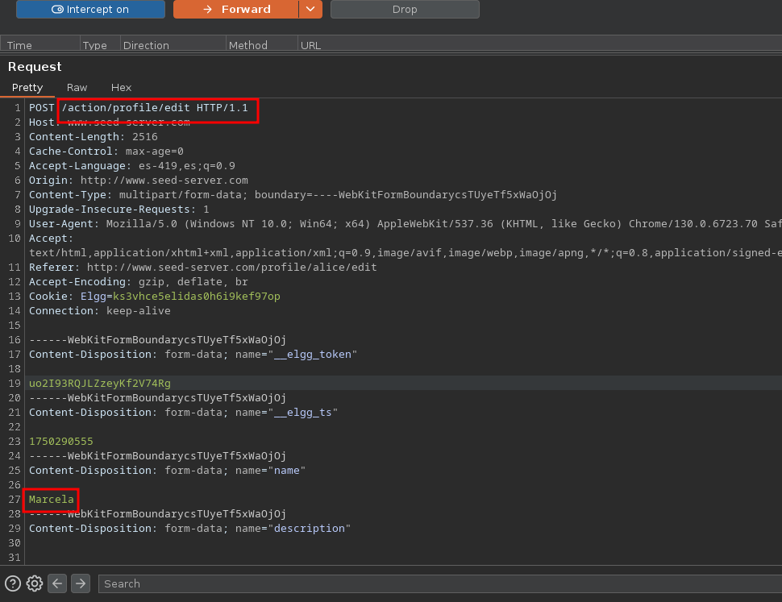
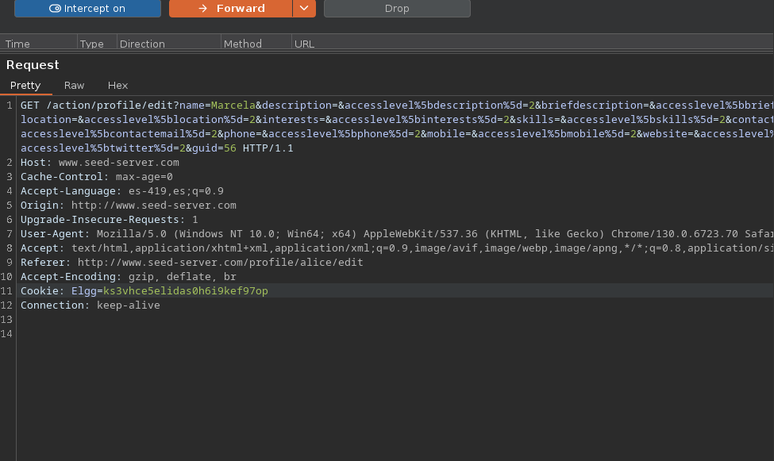
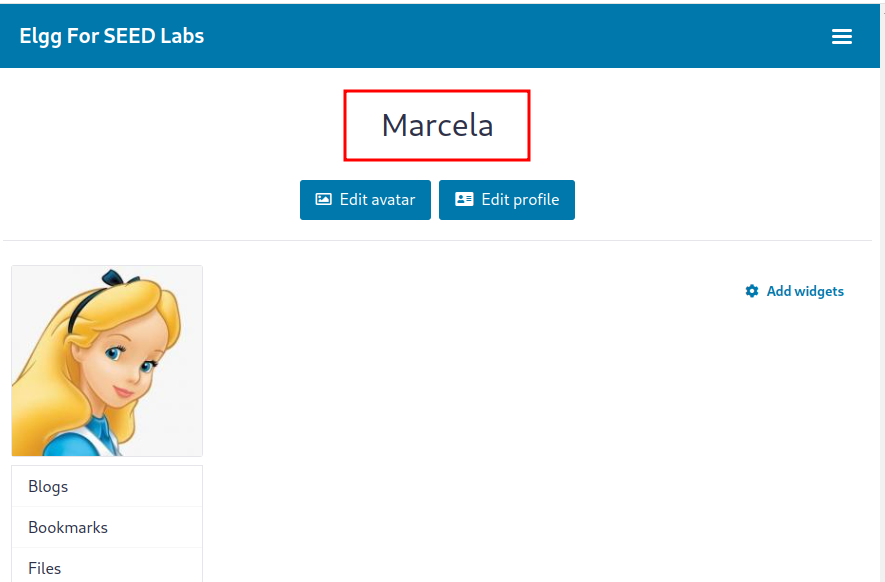
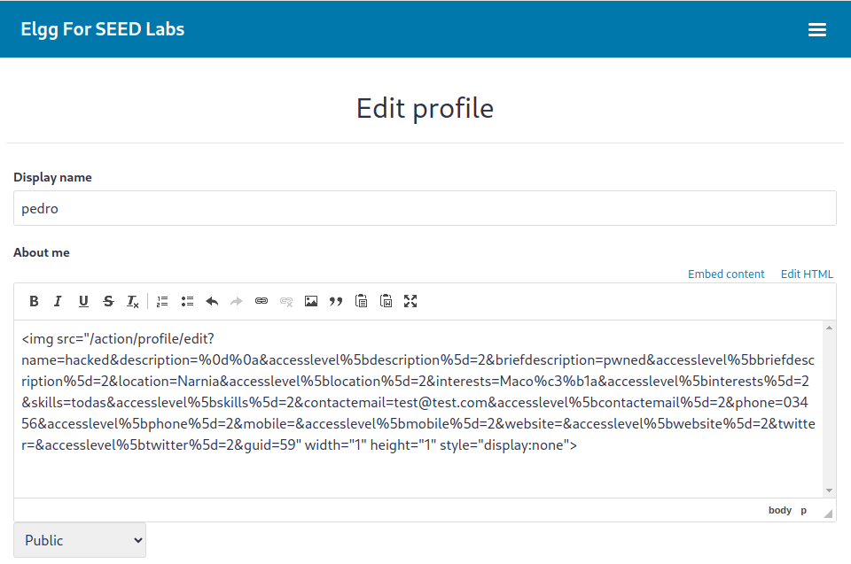

# ¿Que es CSRF?
<br>
CSRF (Cross-Site Request Forgery) es una vulnerabilidad que permite ejecutar acciones no autorizadas en nombre de un usuario autenticado. A diferencia de otros ataques, CSRF no requiere acceso directo a la sesión de la víctima: basta con inducirla a visitar un recurso malicioso mientras tiene una sesión activa en otra aplicación. Este tipo de ataque se basa en la confianza que una aplicación web deposita en el navegador del usuario y puede derivar en cambios de configuración, envío de formularios o modificación de datos críticos, todo sin conocimiento ni consentimiento del afectado.

# Laboratorio 

En este laboratorio se explorará la explotación de la vulnerabilidad CSRF mediante un entorno controlado. El objetivo es comprender cómo un atacante puede forzar acciones sobre una aplicación autenticada desde el navegador de una víctima. Se analizarán los requisitos previos, se construirá un escenario vulnerable y se ejecutará un ataque funcional que demuestre el impacto real de esta falla en la seguridad de aplicaciones web.


## Levantando el laboratorio 

descargar y descomprimir el laboratorio

```sh
wget https://seedsecuritylabs.org/Labs_20.04/Files/Web_CSRF_Elgg/Labsetup.zip
unzip Labsetup.zip
rm !$
docker-compose up -d
```
Levantandor el contenedor

```sh
docker-compose up -d
```

Agregar las ip's de los contenedores al archivo etc/hosts

```zsh
10.9.0.5 www.seed-server-com
10.9.0.5 www.example32.com
19.9.0.105 www.attacker32.com
```

## Primera Fase

Credenciales: 

```bash
alice:seedalice
samy:seedsamy
```

1. Procedemos a logearnos como el usuario alice

2. Abrimos Burpsuite para intentar interceptar alguna peticion, para ver como se esta tramitando.

Podemos ver que se esta tramitando una peticion por POST a la direccion:<br>

```POST /action/profile/edit HTTP/1.1```



podemos intentar cambiar el metodo de la peticion a GET y eliminar el campo ```__elgg_token``` para ver si realmente es necesario.


Deberia quedar algo asi:



Enviamos y observamos que pasa.



Con esto confirmamos que no se estan haciendo validaciones por detras y que el token no es un factor determinante en la peticion que se realice.


## Explotacion

En este laboratorio vamos a explotar esta vulnerabilidad insertando un payload malicioso en nuestro propio perfil público. El objetivo es que, cuando otro usuario autenticado visite nuestro perfil, su navegador envíe automáticamente una solicitud de modificación sobre su propia cuenta, alterando su información sin intervención directa. Esta técnica demuestra cómo acciones legítimas pueden ser subvertidas mediante el simple acto de visitar un contenido manipulado.

## Cargando el payload en el perfil

Para inyectar el payload podemos aprovechar que la misma pagina nos provee un cuerpo html a editar para inyectar una imagen maliciosa

El cuerpo de la solicitud interceptada con burpsuite es la siguiente:

```js
/action/profile/edit?name=pedro&description=%0d%0a&accesslevel%5bdescription%5d=2&briefdescription=sadsadasds&accesslevel%5bbriefdescription%5d=2&location=Mongolia&accesslevel%5blocation%5d=2&interests=Maco%c3%b1a&accesslevel%5binterests%5d=2&skills=todas&accesslevel%5bskills%5d=2&contactemail=test@test.com&accesslevel%5bcontactemail%5d=2&phone=03456&accesslevel%5bphone%5d=2&mobile=&accesslevel%5bmobile%5d=2&website=&accesslevel%5bwebsite%5d=2&twitter=&accesslevel%5btwitter%5d=2&guid=56 
```

Este seria nuestro payload, el cual deberia cargar la victima

```html


```

para realizar esto deberiamos averiguar el guid del usuario victima en este caso es el 59, ahora cuando este usuario visite nuestro perfil va a realizar una consulta sin saberlo lo que va a realizar cambios en su perfil sin su concentimiento.




## Conclusión

La explotación de CSRF demuestra cómo una acción aparentemente inofensiva, como visitar un perfil, puede desencadenar modificaciones silenciosas en los datos del usuario si la aplicación no implementa mecanismos de defensa adecuados. Este laboratorio evidencia la importancia de los tokens antifalsificación y el control estricto del origen de las solicitudes. A través de este ejercicio, no solo se replica una vulnerabilidad clásica, sino que se destaca cómo su presencia aún puede persistir en aplicaciones mal configuradas o sin mantenimiento. La protección contra CSRF no es opcional: es un componente esencial de cualquier sistema autenticado.